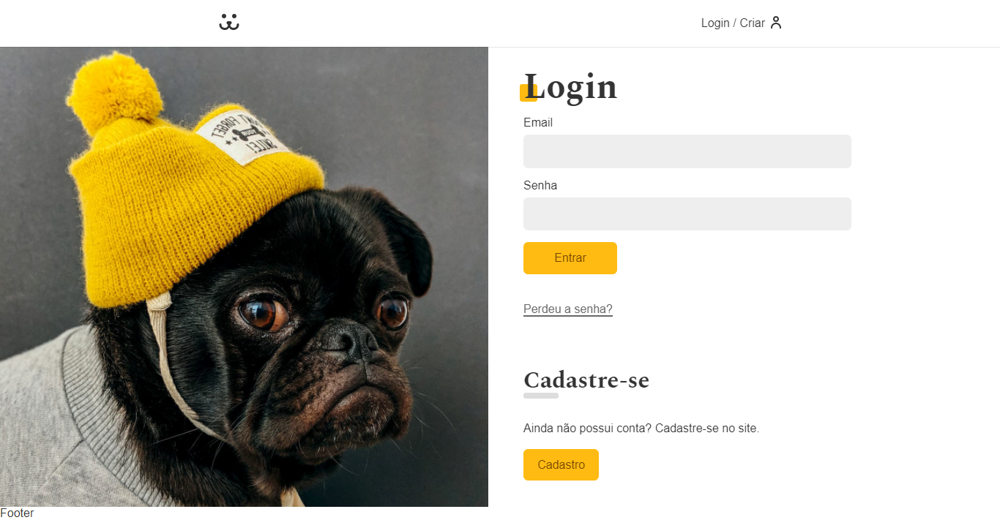

<!--  -->

# Dogs App



> O projeto Dogs App é um site para compartilhamento de fotos de cachorros, que foi desenvolvido no curso de ReactJS da Origamid.

## Tecnologias utilizadas

- Reacts
- Axios

<!-- ## Live Demo -->

<!-- [Live Demo Link](https://livedemo.com) -->

## Como baixar o projeto

### Clonar o repositório

```
$ git clone git@github.com:luiz-gustavo0/app-dogs-react.git
```

### Entrar no diretorio

```
cd app-dogs-react
```

### Instalar as dependencias

```
$ yarn install
```

### Iniciar o projeto

```
$ yarn start
```

## Author

- GitHub: [@luiz-gustavo0](https://github.com/luiz-gustavo0)
- LinkedIn: [LinkedIn](https://www.linkedin.com/in/luiz-gustavo0/)

## 📝 License

MIT

<!-- This project is [MIT](lic.url) licensed. -->
